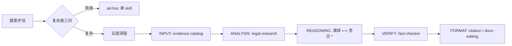

# Legal-Workflow-Chain


**一套法律 AI 工作流方法论,覆盖 接案评估 → 检索 → 推理 → 核查 → 文书 的完整链路。**

*A legal AI workflow methodology covering intake → research → reasoning → verification → drafting.*

[](#-许可与责任--license)
[](#-技能总览--skill-index)
[](#-设计理念--design-philosophy)
[](#-免责声明--disclaimer)
[](#-贡献--contributing)
[](#-项目)
[](#-项目)

[设计理念](#-设计理念--design-philosophy) · [技能总览](#-技能总览--skill-index) · [深链与接力](#-深链与接力--the-deep-chain) · [质量保障](#-质量保障--回归测试) · [使用方式](#-使用方式--usage) · [WorkBuddy 迁移](#-workbuddy-迁移方案) · [贡献](#-贡献--contributing) · [许可与责任](#-许可与责任--license)

---

## ⚠️ 免责声明 · Disclaimer

> 本工作流是**辅助**法律工作者进行分析的工具,**不提供法律意见、不构成法律结论、不能替代律师**。每一份输出都应被视为**供执业法律专业人员审阅的草稿**,而非可直接对外使用或据以作出决定的成果。
>
> - 技能中的检查清单、分析框架、风险提示,以及对法条或裁判规则的归纳,都只是辅助审阅者本人判断的工具,不代表本项目对法律的立场。
> - 本库默认面向**中国大陆成文法体系**。在成文法体系下,案例不具有普遍约束力(最高人民法院指导性案例除外)。涉及其他法域时,使用者必须自行调整相应的法律前提。
> - AI 生成的推理与结论可能存在偏差、遗漏或过时。**最终的法律判断必须由具备执业资格的法律专业人员作出,并由其承担相应责任。**

## 🧭 设计理念 · Design Philosophy

单个 skill 只能做一件事;多步分析要靠**工作流**把每一步串起来。这套方法论的核心不是某个 skill,而是**接力协议**——每一步做完,把「结论 / 依据 / 置信度 / 待核验 / 待办」五字段交给下一步,分析不散、来源不丢。

|  |  |
|---|---|
| 🧩 原子能力 × 6<br>每个 skill 只做一件事:整理证据、检索法条、核查事实、格式化引注、编辑文书、识别图片。它们是可独立调用、可相互组合的**最小单元**。 | 🎼 编排能力 × 1<br>`接案评估`是**入口编排层**:先跑复杂度三问,判断这单走单个 skill、浅链还是五层深链,避免杀鸡用牛刀。 |

**五层架构**(INPUT → ANALYSIS → REASONING → VERIFY → FORMAT):



> \* 推理层(演绎 / 竞合)因来源许可原因未随本仓库分发——方法论见 [五层架构](docs/五层架构.md),落地 skill 请按 [推理层接入指南](docs/推理层-接入指南.md) 下载原版并本地接线(非商用)。详见[许可与责任](#-许可与责任--license)。

三条贯穿性原则:

| 原则 | 做了什么 |
|------|---------|
| 🎯 **可选深链** | 简单任务走一个 skill 直接出活;复杂案件才走五层。由复杂度三问(争点数 / 多主体多法律关系 / 法条竞合)自动判断,不打断你 |
| 🔗 **结构化交接** | skill 之间传五字段(结论 / 依据 / 置信度 / 待核验 / 待办),依据跟着结论走,回头能查到来源 |
| 🛡️ **对抗幻觉** | 案号、法条、当事人等**零容忍项**逐步核验,不确定就标 `[待核实]`,绝不编造 |

## 📚 技能总览 · Skill Index

7 个技能 + 1 个编排入口,按五层组织:

| 层级 | 技能 | 做什么 |
|------|------|--------|
| 入口 | **接案评估** | 接案前评估,实习/执业双模式,按复杂度分流 |
| INPUT | **evidence-catalog-generator** | 证据材料整理 → 证据目录 |
| ANALYSIS | **legal-research** | 中国法律检索(元典 MCP + tavily 兜底) |
| VERIFY | **legal-fact-checker** | 核查事实——零容忍项不放过 |
| FORMAT | **legal-citation-comprehensive** | 法学引注诊断补全格式化 |
| FORMAT | **docx-editing** | docx 编辑,保留格式 + 修订追踪 |
| 工具 | **vision** | 视觉识别(聊天截图、证据照片) |

> ⚠️ **许可说明**:原整合的 `deductive-reasoning` / `dispute-issue-identification` / `conflict-resolution` 三个 skill 源自 **THUYRan/Legal-Skills-Chinese**(CC BY-NC-ND 4.0,禁止修改后分发),**未随本仓库分发**。其余技能来源与许可对照见 [docs/credits.md](docs/credits.md)。

## 🔀 深链与接力 · The Deep Chain

复杂案件走完整五层,每一跳用统一格式交接(以推理层为例,该层 skill 需自行接入):

```
[Skill接力: conflict-resolution]
接力上下文:
- 结论:   C2 违约金标准存在三标准竞合
- 依据:   合同日万分之五 / 民间借贷解释 28 / 买卖解释 18(4)
- 置信度: 中(标准选择需类案支撑)
- 待核验: 合同违约金条款原文
待办:     裁决适用标准并返回 deductive 重跑三段论
```

- **路由冲突裁决**:同时命中多个 skill 时,按「用户指名 → 有事实+法条 → 有事实无法条 → 已有草稿 → 只问法条 → 纯格式」的顺序分流
- **运行监控**:接力过程中静默检查 F1-F5 类故障(上下文断裂 / 接力丢失 / 接力循环 / 结论矛盾 / 错位接力),仅发现问题时报告——需把编排层(CLAUDE.md 模板「Skill 路由架构」一节)写进你的 CLAUDE.md 才生效
- **回归测试**:改完 skill 后跑一遍 [回归测试集](docs/回归测试集.md),确认衔接不被破坏

## 🛡️ 质量保障 · 回归测试

本工作流自带一份**手动回归测试集**(3 个典型路径):

| 用例 | 覆盖 | 权重 |
|------|------|------|
| 五层深链 | 从接案评估到引注格式化的完整接力 | 🔴 最重 |
| ad-hoc 单 skill | 简单任务不走深链、正常出活 | 🟡 轻 |
| 接案评估入口 | 双模式输出 + 复杂度分流 + 运行日志 | 🟡 新 |

> 每改一个 relay skill,至少跑一遍最深的那条链——它能最直接暴露接力衔接被破坏。详见 [回归测试集](docs/回归测试集.md)。

## 🚀 使用方式 · Usage

这些技能遵循 Anthropic Agent Skills 的 `SKILL.md` 约定,可在任何兼容环境使用(Claude Code / Codex / Cursor)。

### ✅ 交付分层(装完能跑到什么程度)

| 能力 | 状态 | 要做什么 |
|------|------|---------|
| 7 个 skill 单独调用 | ✅ 内置 | 复制到 `skills/` 目录即可用 |
| 五层深链完整接力 | ⚠️ 需接线 | skill 元件 + 完整协议见 [推理层接入指南](docs/推理层-接入指南.md) |
| 路由裁决 / F1-F5 监控 / relay-log | ⚠️ 需启用 | 编排规则已写入 CLAUDE.md 模板,照抄即生效 |
| 接案评估双模式 + 运行日志 | ⚠️ 半内置 | skill 内置;自动触发规则在 CLAUDE.md 模板中,需启用 |
| wiki 知识库 | 🧱 自建 | CLAUDE.md 模板 + [Wiki 知识库搭建](docs/wiki-知识库搭建.md) 教方法,内容自己攒 |

> 一句话:**方法论和元件都在仓库;让它们自动跑起来的"编排手"在 CLAUDE.md——模板已含,启用即生效。** 不启用编排层,每个 skill 仍可独立使用,只是不会自动串联成深链。

**三档深度,由复杂度三问自动判断:**

<details>
<summary><b>① 简单任务</b> — 一个 skill 直接出活(检索法条、起草文书、核查事实)</summary>

```text
用户:帮我起草一份律师函,对方欠货款 32000 元,2026-04-01 到期,逾期至今。

Agent(legal-fact-checker):
  一、事实核对:欠款 32000 元 / 到期日 2026-04-01 / 逾期已超 90 天 → 部分待核实(有无对账单?)
  二、起草律师函初稿:
      - 事实陈述(依你提供的欠款汇总表)
      - 法律依据:《民法典》第 626 条(付款义务)+ 第 628 条(逾期利息)[待核实:利息起算日]
      - 催告 + 限期支付 + 逾期后果
  三、标注 [待核实] 项:① 有无书面对账单 ② 是否约定违约金
```

</details>

<details>
<summary><b>② 中等任务</b> — 浅链(争点 → 检索 → 核查,不深入推理)</summary>

```text
用户:这个案子我要不要先保全?对方好像有转移财产的风险。

Agent:
  → dispute-issue 识别争点:货款 + 财产保全必要性
  → legal-research 检索:诉前保全条件(民诉法第 104 条)、担保要求
  → fact-checker 核查:申请材料清单(保全申请书/担保/线索)
  输出:保全可行性 + 材料清单 + [待核验](对方财产线索需确认)
```

</details>

<details>
<summary><b>③ 复杂任务</b> — 五层深链(接案评估 → 完整接力;推理层 skill 需自行接入)</summary>

```text
用户:这个买卖合同纠纷,货送了钱没收到,还有 3 个保证人,违约金写了日万分之五,帮我看看能不能打。

Agent:
  ① 接案评估 → 《案件评估报告》:多被告(1 债务人 + 3 保证人)+ 违约金竞合 → 建议走深链
  ② dispute-issue → 4 个核心争点(C1 货款 / C2 违约金标准 / C3 保证责任 / C4 夫妻共同债务)
  ③ legal-research → 检索《民法典》584/585/626/688 条 + 买卖解释 18(4) + 民间借贷解释 28
  ④ deductive → 对 C2 做三段论:日万分之五 vs 年利率 24% vs LPR 四倍,哪个适用
  ⑤ conflict → 竞合裁决:日万分之五(合同约定)与 LPR 四倍(法定上限)的关系 → 类案支撑
  ⑥ fact-checker → 核验金额 98,600 元、当事人身份、法条原文
  ⑦ citation → 规范化引注
```

> 示例中 ②④⑤ 步的争点识别与推理层 skill,按 [推理层接入指南](docs/推理层-接入指南.md) 本地接线后即可用;仓库内已提供的 skill 可直接跑其余步骤。

</details>

### 🔌 接入真实数据 · MCP

检索类技能只定义方法论,不绑定数据库。接入真实、现行、可溯源的数据,需为运行环境接 MCP:

| 数据源 | MCP | 兜底 |
|--------|-----|------|
| 法条 / 案例 / 企业 | 元典 MCP(三个服务器) | tavily 联网检索 |
| 文档处理 | safe-docx + pdf-tools(本地) | — |

> 未接入任何数据库时,技能仍可运行,但所有案例/法条须标注 `[待核实]`/`[待补]`,绝不编造。

### 💻 我的完整形态(参考配置)

我本地是一台 Windows 笔记本,这套工作流按我的实际习惯搭的。**你不需要全配齐**——对照着选就行:

| 环境项 | 我的配置 | 说明 |
|--------|---------|------|
| Agent 平台 | VS Code 里的 Claude Code 扩展 | 也可以用 CLI / Codex / Cursor |
| 知识库 | Obsidian(vault 就是工作目录) | CLAUDE.md 管 wiki,见 [Wiki 知识库搭建](docs/wiki-知识库搭建.md) |
| 大模型 | DeepSeek 走 CC-switch 代理,Flash 主力 + PRO 备用 | `/model` 切换;日常省钱,复杂硬推理才切 |
| 法条/案例/企业 | 元典 MCP(三个服务器) | 中国法条语义检索、案例详情、企业涉诉 |
| 联网兜底 | tavily MCP | 元典不可用时自动降级 |
| 文档处理 | safe-docx + pdf-tools(本地) | docx 保留格式编辑、PDF 处理 |
| 视觉识别 | GLM 视觉(聊天截图、证据照片) | 粘贴图全自动识别 |
| 身份 | 实习/执业 双模式 | 接案评估按当前身份输出 |

### 📦 环境要求

- **Claude Code v2.1+**(也兼容 Codex / Cursor / OpenCode)
- **Python 3.10+**(只有 vision / evidence-catalog 两个 skill 需要)

```bash
pip install anthropic openai      # vision 视觉识别
pip install python-docx openpyxl  # evidence-catalog 证据目录
```

> 4 个核心 skill 不需要任何 Python 依赖,纯文本推理直接跑。

### 🗂️ 目录结构

```
Legal-Workflow-Chain/
├── README.md
├── CLAUDE.md            # 操作用指南模板(搭配 Obsidian wiki 使用)
├── LICENSE              # MIT
├── docs/
│   ├── 五层架构.md        # 组织 / 接力 / 路由裁决 / 监控 / 可选深链
│   ├── 推理层-接入指南.md  # 从原库自取 + 本地接线(CC BY-NC-ND 合规)
│   ├── 接案评估.md        # 入口 / 双模式 / 分流 / 运行日志
│   ├── 回归测试集.md      # 改完 skill 后跑一遍的 checklist
│   ├── wiki-知识库搭建.md # Obsidian wiki 怎么搭、和 CLAUDE.md 怎么联动
│   └── credits.md        # 来源对照 + 许可声明
├── assets/              # README 视觉资产(banner)
├── skills/              # 全部 7 个技能,每个一个目录 + SKILL.md(Claude Code 版)
└── workbuddy/           # WorkBuddy 迁移方案(适配版 skill/编排/安装引导)
```

## 🔀 WorkBuddy 迁移方案（实测验证通过）

想把这套工作流装进 **腾讯 WorkBuddy**（桌面 agent，低门槛，无需装 VS Code + Claude Code）？项目提供**第二套方案**，已在真实环境完整验证（2026-08-07，T1-T9 全过 + 全量自检 8/8）：

- **[workbuddy/ 迁移方案](workbuddy/README.md)** — WorkBuddy 适配版：8 个随包技能（含 `workflow-overview` 总览）+ 推理层 3 个按[接入指南](docs/推理层-接入指南.md#四bworkbuddy-用户的适配用-workbuddy-而非-claude-code-时)自取接线（[适配工具](workbuddy/推理层适配工具/README.md) 一键改 description，凑齐 11 个）+ 编排规则 + 引导式安装（模型 / MCP / Obsidian / OCR 两档，OCR 工具随包）
- **知识库复利对齐**：项目「指令」字段 = WorkBuddy 的 CLAUDE.md——收纳（Ingest）、高价值问答主动提醒收纳、提炼式案件归档（复盘/回溯）、图片处理路由（DeepSeek 无视觉 → 切视觉模型/走本地 OCR）全部写成指令条目，WorkBuddy 每次对话强制遵守。**进阶**：插件化 Hook 强制注入 wiki 索引（[方案](workbuddy/docs/workbuddy-hook-知识库强制注入.md)），"回答前先读 wiki"从软规则升级为技术强制
- **实测验证**：T1-T9 全部通过（9/9）＋环境全量自检 8/8——技能触发/编排/元典检索/内置联网/知识库收纳+复用+lint/深链自主规划全链路跑通；`[待核实]` 零容忍、法条元典核验不凭记忆、收纳增量判断均正确执行
- **核心区别**：Claude Code 版靠 CLAUDE.md **强约束接力**；WorkBuddy 版靠**自主规划 + 触发钩子**（description 统一优化 + 总览 skill）+ 插件化 hooks，适配 WorkBuddy 的模型触发机制
- **上手操作路径**：一切在「**项目**」里配（项目内加技能 + 项目内贴指令 + 用户级 MEMORY.md 固定文件目录），一切对话在「**空间**」里开（左侧空间选该项目 → 新建对话）——见 [workbuddy/README 上手操作路径](workbuddy/README.md#上手操作路径workbuddy-里具体点哪几步)
- **关键机制差异**（实测踩坑）：① WorkBuddy **顶层 settings.json hooks 字段被忽略**，必须走插件机制（市场注册→plugin.json→enabledPlugins→完全重启），不能按 Claude 文档照搬；② 项目 = 会话分组 ≠ 文件工作目录，新对话默认临时目录，固定目录靠**用户级 `~/.workbuddy/MEMORY.md`**；③ 联网内置（无需 tavily），GLM 界面直接添加（无需改 models.json）
- **两套独立**：主仓库 `skills/` 是 Claude Code 版（7 个）；`workbuddy/skills/` 是 WorkBuddy 适配版（8 个随包，description 已为 WorkBuddy 模型定制）。推理层 3 个（争点/演绎/竞合）因 CC BY-NC-ND 均不随仓库分发，两套都需按[接入指南](docs/推理层-接入指南.md)自取接线

## 🤝 贡献 · Contributing

有问题 / 建议 / 想提交你的 skill?开 [Issue](https://github.com/lawyerllsx-dotcom/Legal-Workflow-Chain/issues) 或提 PR。

新 skill 遵循三条:**一个 skill 只做一件事** · **带结构化接力上下文(五字段)** · **可回归测试**。

## 📄 许可与责任 · License

项目本身以 **MIT** 授权。项目不含案件、客户、密钥数据;本地私密资料不在此处。

- **关于推理层三个 skill**:本项目原整合的 `deductive-reasoning` / `dispute-issue-identification` / `conflict-resolution` 源自 **CC BY-NC-ND 4.0** 项目(THUYRan/Legal-Skills-Chinese)。该许可禁止衍生修改后再分发,因此**这三个 skill 未随本仓库分发**,仅保留方法论(见 [五层架构](docs/五层架构.md))。需要使用时,请按 [推理层接入指南](docs/推理层-接入指南.md) 从 [THUYRan 原库](https://github.com/THUYRan/Legal-Skills-Chinese) 下载原版并本地接线(个人非商用自用)。
- 其余 skill 的来源许可见 [docs/credits.md](docs/credits.md),使用或再分发时请一并保留原版权声明。
- **任何对外的法律工作成果,其专业责任由使用该成果的执业人员承担,而非本项目或本项目的贡献者。**

## 🙏 致谢 · Acknowledgments

本项目整合了多个开源法律 AI 技能库,经本地化修改后形成。**没有这些项目,就没有 Legal-Workflow-Chain。**

- **THUYRan/Legal-Skills-Chinese** — 五层架构中「推理层」方法的出处(演绎 / 争点 / 竞合),12 位执业法律专业人员手写验证。因许可原因其 skill 未随本仓库分发,但方法论深受启发
- **Golden2002/legal-research-skill** — 法律检索方法论
- **NEU-ZHA/legal-ai-skills** — 事实核查 / 引注 / 文书处理思路
- **fayayy888/legal-document-assistant** — 接案评估十步骨架
- **xiincs/claude-code-vision-skill** — 视觉识别
- **Anthropic** — Agent Skills 标准与示例

## 👥 项目

**⚖️ 如果这个库对你有帮助,欢迎点一个 Star —— 它能帮助更多法律人和研究者发现它。**
