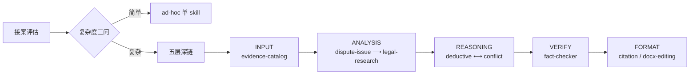

# 五层 Skill 架构

法律 AI Agent 工作流的 Skill 组织方式。核心思路：**把"检索 → 分析 → 推理 → 核验 → 格式化"的法律作业流程拆成可接力、可监控的原子 Skill**，而不是一个塞满一切的巨型提示词。



> ⚠️ **许可说明(2026-08-05)**:`deductive-reasoning` / `dispute-issue-identification` / `conflict-resolution` 源自 [THUYRan/Legal-Skills-Chinese](https://github.com/THUYRan/Legal-Skills-Chinese)(CC BY-NC-ND 4.0,禁止修改后分发),**未随本仓库分发**。本页与 README 保留其方法论描述;需要落地 skill 请按 [推理层接入指南](推理层-接入指南.md) 下载原版并本地接线(个人非商用)。仓库内可运行的 skill 见 README 技能总览。

## 一、五层组织

| 层 | Skill | 典型链 |
|----|-------|--------|
| INPUT | evidence-catalog | 证据目录 → 手动编辑 docx |
| ANALYSIS | dispute-issue → legal-research | 争议焦点 → 法条检索 |
| REASONING | deductive ⟷ conflict | 三段论 ↔ 竞合解决（紧耦合） |
| VERIFY | fact-checker | 质检关口 → 分流回 reasoning |
| FORMAT | citation / docx-editing | 引注格式化 → 手动编辑 docx |

> 缩写：dispute-issue = dispute-issue-identification / deductive = deductive-reasoning / conflict = conflict-resolution / fact-checker = legal-fact-checker / citation = legal-citation-comprehensive

## 二、接力标记

每个 relay skill 输出末尾带接力标记，下一个 skill 靠它接手：

```
[Skill接力: <下一个 skill 名>]
```

接力上下文字段（五字段，逐跳完整传递）：

| 字段 | 含义 |
|------|------|
| **结论** | 本跳的结论 |
| **依据** | 关键法条/事实，分条列出 |
| **置信度** | 高/中/低 + 理由 |
| **待核验项** | 需要下一跳核验的 `[待核验]` 清单 |
| **待办** | 下一 skill 需要完成的具体任务 |

## 三、路由冲突裁决（多 skill 匹配时）

1. 用户显式指名 → 直接用
2. 有事实 + 法条 → deductive 优先
3. 有事实无法条 → dispute-issue → legal-research
4. 已有文书草稿 → fact-checker 优先
5. 只问法条 → legal-research 优先
6. docx/格式 → 直接对应工具

## 四、运行监控（F1-F5）

每次接力静默检查，仅发现问题时报告：

| 故障 | 含义 |
|------|------|
| F1 上下文断裂 | 重复询问已有信息 |
| F2 接力丢失 | 非终点无标记 |
| F3 接力循环 | 3 轮内 A↔A |
| F4 路由冲突 | 同轮两个 skill 结论矛盾 |
| F5 错位接力 | 偏离预期链 2 步以上 |

## 五、可选深链（2026-08-05 起）

五层链是**可选深链**——简单/模板化任务走 ad-hoc 单 skill，复杂案件才走深链。

**复杂度三问**（接案时判断，命中任一 → 主动询问是否走深链）：
1. 核心争点 ≥ 3？
2. 多被告 / 多法律关系叠加？
3. 存在法条竞合 / 司法解释冲突 / 类案分歧？

否则直接 ad-hoc，不打扰。deep-chain 只在真走深链时记录。

## 六、反馈闭环

- **relay-log**：深链运行时逐跳记录（成功/失败/故障），用于回溯与统计
- **接案评估运行日志**：每次接案评估跑完记一行（模式 / 案子类型 / 标的 / 不顺点 / 改进），为 skill 迭代攒数据

> 设计哲学：**机制喂数据，数据养机制。** skill 是否有效，靠真实案件运行日志说了算，不靠设计者自我感觉。

## 相关文档

- [README](../README.md) — 项目总览 / 快速开始
- [接案评估](接案评估.md) — 接案入口 + 双模式 + 复杂度分流
- [回归测试集](回归测试集.md) — 改 skill 后的最小回归路径
