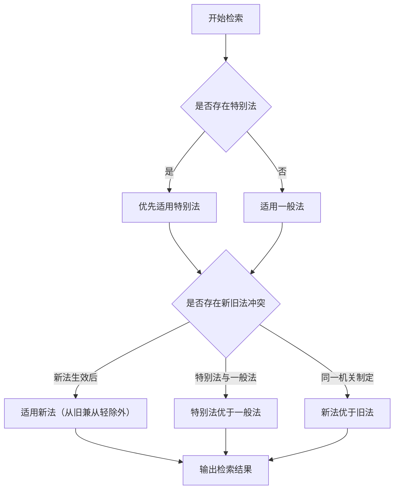

### 威科先行 API 确认与配置（自动化）

**【时机】在第二阶段事实确认完成后，进入第三阶段检索前执行。**

#### W.1 询问用户是否拥有威科先行 API

在事实确认后，**主动询问**：

```
现在进入法律检索阶段。在开始之前，请问您是否拥有威科先行数据库的 API 权限？

- 有（我帮您配置并自动调用威科补充检索）
- 没有（仅使用公开渠道检索）
```

#### W.2 如果用户回答"有"

**依次询问以下信息：**

```
请提供威科先行 API 的以下信息（我帮您自动配置）：

1. API 端点地址（API_BASE_URL）
   - 威科提供的 API 接入地址，如 https://api.wkinfo.com.cn/v1

2. API Key（API_KEY）
   - 您的 API 密钥

3. API Secret（API_SECRET）
   - 您的 API 密钥（可选，如威科需要）

4. 认证方式（AUTH_TYPE）
   - Bearer / API-Key（默认 Bearer）
```

**收到信息后，自动执行以下操作：**

1. **写入配置文件**：在 skill 目录创建/更新 `config.json`
   ```python
   import json
   import os
   
   skill_dir = "skill所在目录"  # 自动获取
   config_path = os.path.join(skill_dir, "config.json")
   
   config = {
       "API_BASE_URL": 用户提供的端点,
       "API_KEY": 用户提供的Key,
       "API_SECRET": 用户提供的Secret（如有）,
       "AUTH_TYPE": 用户选择的方式
   }
   
   with open(config_path, "w", encoding="utf-8") as f:
       json.dump(config, f, ensure_ascii=False, indent=4)
   ```

2. **验证配置**：调用 `WoltersAuto.is_configured()` 确认写入成功

3. **自动执行威科检索**：使用已确认的法律问题作为关键词
   ```python
   from wolters_wrapper import wolters_auto_search
   
   wolters_result = wolters_auto_search(
       legal_issue="【从已确认事实中提取的核心法律问题关键词】",
       legal_type="【根据争议类型映射：劳动争议→labor，合同纠纷→civil等】",
       region="【用户提供的地域】",
       date_range={"from": "【如有】", "to": "【如有】"}
   )
   ```

4. **告知用户**：
   ```
   ✅ 威科先行 API 已配置成功！
   已使用"【法律问题关键词】"自动开始检索...
   
   正在合并公开渠道 + 威科先行数据，预计稍后为您提供完整报告。
   ```

#### W.3 如果用户回答"没有"

继续使用公开渠道检索，告知用户：

```
好的，将仅使用公开渠道（北大法宝、法信、最高人民法院官网等）进行检索。
如后续需要接入威科先行 API，可以随时告诉我。
```

#### W.4 关键词提取规则

从已确认的事实总结中提取检索关键词：

| 事实总结内容 | 提取的关键词 |
|---|---|
| 违法解除劳动合同索赔2N | 违法解除劳动合同赔偿金 |
| 公司拖欠三个月工资 | 拖欠工资 劳动报酬 |
| 工伤后公司不赔偿 | 工伤保险待遇 赔偿责任 |
| 购房合同违约定金不退 | 商品房买卖合同 定金 违约 |

**原则**：取核心争议点，去除语气词和冗余描述，用简短关键词检索效果更好。

#### W.5 配置失败处理

- 如果配置写入失败：告知用户配置失败，但不影响主流程，继续公开检索
- 如果 API 调用失败：返回 `available=False`，继续公开检索，不中断
- 用户可随时说"重新配置威科 API"来更新配置

---

### 第三阶段：系统性检索

**【前置条件检查】**
只有当用户已确认事实后，才能进入本阶段检索法律依据。

如有威科先行 API 配置（config.json 存在），威科检索结果应与公开渠道结果**合并**输出。

#### 3.1 检索范围

按效力层级从高到低检索相关规范：

**1. 法律**
- 核心法律及全国人大常委会决定
- 举例：《劳动法》《劳动合同法》《民法典》《刑法》等

**2. 行政法规**
- 国务院制定的实施条例
- 举例：《劳动合同法实施条例》《工伤保险条例》《保障农民工工资支付条例》等

**3. 司法解释（重点检索）**
- 最高人民法院、最高人民检察院发布的司法解释
- 含有答复、批复、复函、会议纪要等
- 举例：法释〔2020〕17号、法发〔2021〕20号、〔2023〕12号等

**4. 最高人民法院指导性案例（具有参照效力）**
- 最高人民法院发布的指导性案例
- 案号格式：法例字第X号
- 效力：各级法院审理类似案件时应参照

**5. 最高人民法院典型案例（仅供参考）**
- 最高人民法院发布的典型案例
- 各级法院精选案例
- 效力：仅供参照，不能作为裁判依据

**6. 最高人民检察院指导性案例**
- 检察指导性案例
- 案号：高检发例字〔XXXX〕X号

**7. 部门规章**
- 国务院部委相关实施细则
- 举例：《工资支付暂行规定》《最低工资规定》等

**8. 地方性规定**
- 按用户提供的地域检索地方条例、规章、司法文件
- 举例：《上海市劳动合同条例》《广东省工资支付条例》等

**9. 威科先行数据库（自动调用，配置即可用）**
- 如用户在 skill 目录配置了 `config.json`，检索阶段自动补充威科数据
- 支持：法律法规、案例、裁判文书、司法解释、指导性案例等
- 调用方式：skill 流程自动调用 `wolters_wrapper.wolters_auto_search()`
- API 配置：只需在 `config.json` 中填入凭证，**无需修改任何代码**

> **【威科先行 API 用户配置说明】（非开发者友好）**
>
> 配置步骤：
> 1. **获取 API 权限**：联系威科先行申请机构用户 API 权限

## 八、检索数据库推荐

### 主要检索途径

| 数据库 | 网址 | 特点 |
| :--- | :--- | :--- |
| 北大法宝 | www.pkulaw.cn | 最全法规数据库，收录全面 |
| 法信 | www.faxin.cn | 法律检索平台 |
| 威科先行 | wkinfo.com.cn | 外商投资、劳动等领域突出 |
| 法律出版社 | www.lawpress.com.cn | 法规解读权威 |
| 最高人民法院官网 | www.court.gov.cn | 司法解释、指导案例 |
| 全国人大官网 | www.npc.gov.cn | 法律文本 |
| 国务院官网 | www.gov.cn | 行政法规 |

## 九、法律适用判断流程



## 十、常见检索错误警示

| 错误类型 | 说明 | 正确做法 |
| :--- | :--- | :--- |
| ❌ 混为一谈 | 将"司法解释"与"指导性案例"混淆 | 司法解释具有法律效力；指导性案例具有参照效力 |
| ❌ 引用失效法条 | 引用已失效/废止的法条 | 核查法条效力状态，标注有效期 |
| ❌ 忽略地域限制 | 误用地方性规定于全国 | 标注地方性规定的适用范围 |
| ❌ 混淆法规层级 | 将部门规章误认为行政法规 | 按制定主体正确区分效力层级 |
| ❌ 遗漏法律变更 | 未说明新旧法替代关系 | 标注法律变更时间节点和适用规则 |
### 12.1 检索优先级规范（2026年3月更新）

**本次实践中发现的问题**：
- 外部API（Google Search、Exa）存在访问限制和配额限制
- 通用搜索引擎返回结果不够精准，法律专业内容混杂
- 编造案例会导致报告失实，必须使用真实案例

**优化后的检索优先级：**

#### 第一优先级：专业法律数据库

| 数据库 | 网址 | 优先级 | 说明 |
| :--- | :--- | :--- | :--- |
| 北大法宝 | www.pkulaw.cn | **最高** | 最全法规数据库，收录全面，应作为首选 |
| 法信 | www.faxin.cn | **高** | 法律检索平台，侧重法律适用 |
| 威科先行 | wkinfo.com.cn | **高** | 外商投资、劳动等领域突出 |
| 法律出版社 | www.lawpress.com.cn | **中** | 法规解读权威 |
| 最高人民法院官网 | www.court.gov.cn | **高** | 司法解释、指导性案例、典型案例（均为真实案例） |
| 最高人民检察院官网 | www.spp.gov.cn | **中** | 检察指导性案例 |
| 全国人大官网 | www.npc.gov.cn | **高** | 法律文本原文 |
| 国务院官网 | www.gov.cn | **高** | 行政法规原文 |
| 国家税务总局官网 | www.chinatax.gov.cn | **高** | 税务法规、偷逃税典型案例 |
| 中央纪委国家监委官网 | www.ccdi.gov.cn | **中** | 党纪处分案例、廉洁从业规定 |

#### 第二优先级：政府公开网站

| 网站 | 网址 | 适用场景 |
| :--- | :--- | :--- |
| 中国裁判文书网 | wenshu.court.gov.cn | 真实判决案例检索 |
| 人民法院公告网 | www.court.gov.cn/zixun | 最高人民法院最新发布 |
| 国家法律法规数据库 | flk.npc.gov.cn | 国家法规统一检索 |

#### 第三优先级：其他补充来源

- 权威法律公众号（如"最高人民法院""检察日报"等）
- 官方媒体发布的案例报道（需核实真实性）
- 律师事务所专业文章（仅作参考，不能作为法律依据）

#### 禁止使用

- ❌ 匿名百科类网站（如搜狗百科、百度百科等）
- ❌ 未经核实的案例故事
- ❌ 学术论文中的案例（可能存在虚构）
- ❌ 社交媒体讨论中的案例

### 12.2 案例真实性验证要求

**【强制要求】**

检索到的案例必须包含以下要素之一，方可使用：

1. **最高人民法院指导性案例**（具有参照效力）
   - 案号格式：指导性案例第XX号
   - 来源：最高人民法院公报或官网

2. **最高人民法院典型案例**（仅供参考）
   - 来源：最高人民法院官方发布
   - 标注"仅供参考"

3. **国家税务总局典型案例**
